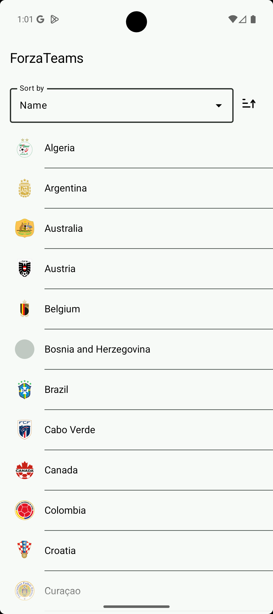
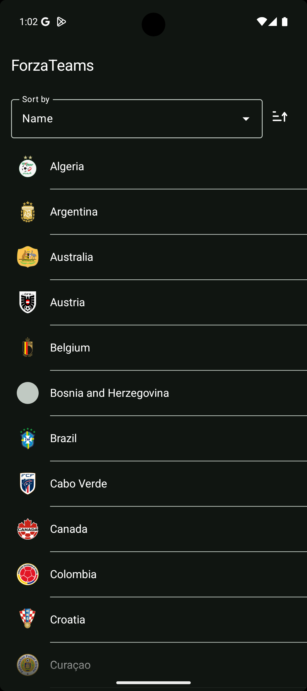

# ForzaTeams

<p>
  
  
</p>

## Theme

I went with a fully custom theme instead of MaterialTheme.

MaterialTheme works fine, but I find it easier to work with something I fully own. Material's API shifts between versions and brings a lot of implicit contracts that don't always map well to a custom design. A custom `AppTheme` on top of `CompositionLocalProvider` gives me exactly what I need and nothing I don't.

### Structure

| File | Purpose |
|---|---|
| `ui/theme/AppTheme.kt` | Entry point, `AppTheme` accessor object, MaterialTheme bridge |
| `ui/theme/ColorScheme.kt` | `ColorScheme` data class, `lightColorScheme()` / `darkColorScheme()` |
| `ui/theme/ColorTokens.kt` | Raw color constants |
| `ui/theme/Typography.kt` | `Typography` data class with named text styles |
| `ui/theme/TypographyTokens.kt` | Raw font size and line height constants |
| `ui/theme/Dimens.kt` | `Dimens` data class with spacing values |
| `ui/theme/DimenTokens.kt` | Raw dp constants |
| `ui/theme/Shapes.kt` | `Shapes` data class — small, medium, large, circle |

### Usage

```kotlin
AppTheme.colors.primaryColor
AppTheme.typography.teamName
AppTheme.dimens.dp16
AppTheme.shapes.circle
```

### Colors

`ColorScheme` has 9 semantic tokens: `primaryColor`, `primary15`, `rippleColor`, `textColor`, `dividerColor`, `backgroundColor`, `skeletonColor`, `buttonColor`, `buttonTextColor`. Light and dark variants switch automatically with the system theme.

### Typography

5 named styles: `teamName`, `sortValue`, `sheetTitle`, `statLabel`, `statValue`.

### MaterialTheme bridge

`AppTheme` maps custom tokens onto Material's color scheme so that Material components pick up the right colors without per-component overrides.

## Architecture

No use cases or interactors — the ViewModel talks to the repository directly.

Use cases make sense when logic is complex, shared between screens, or needs isolated testing. None of that is true here. One screen, one data source, straightforward logic. An extra layer would just be empty wrapper classes.

## ViewModel state

Each ViewModel has two state objects: an internal `State` and a UI-facing `StateUi`.

`State` holds raw domain data and screen flags. `StateUi` is a sealed interface mapped from it — everything already converted to `TextUi`, `ImageUi`, and other UI primitives, ready for the composable to render.

The cost is an extra mapping on every emission and a bit more GC work. On modern Android it's not really a problem, but it's still a real cost. What you get in return is composables that receive exactly what they need with no branching, and two layers that can change independently. I'll take that trade.

## If I had more time

**Remote config.** I'd add a remote config layer to control the base URLs for the teams list and flag images. For images this would also fix the cache invalidation problem — right now there's no way to expire Coil's disk cache, but changing the URL would bust it naturally.

**Tablet support.** The layout is phone-only. On a tablet the obvious move is a list-detail split — teams on the left, detail panel on the right instead of a bottom sheet.

**Unit tests.** At least for the ViewModel — sorting, selection logic, and state transitions are all worth covering. Not a lot of code, but it would catch regressions.

**Team logo background.** Some logos are transparent or light and disappear into the background. I'd look into extracting a dominant colour from the image at load time and using it as a backdrop, or applying a scrim.

**Animations.** The transitions work but they're bare minimum. I'd invest more time here — shared element transitions between the list and detail, better selection feedback, smoother sort reordering.

## Accessibility

Intentionally skipped. Given the scope of the project it didn't feel worth the complexity.

## Libraries

- **Jetpack Compose** — declarative UI
- **ViewModel + Lifecycle** — screen-scoped state that survives configuration changes
- **Room** — local database
- **Retrofit + kotlinx.serialization** — networking and JSON parsing
- **Coil** — image loading
- **Koin** — dependency injection
- **Coroutines + Flow** — async work and reactive state
